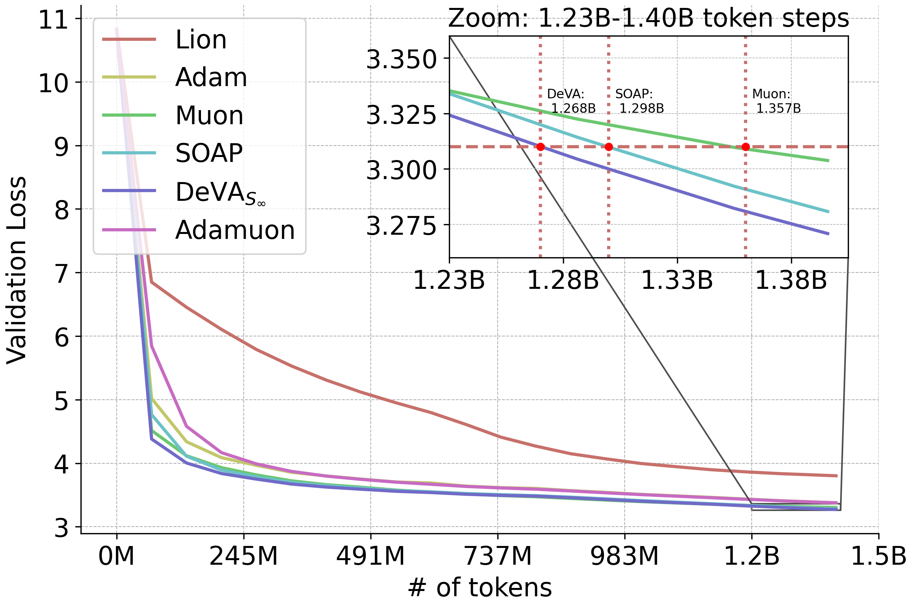

# DeVA: Decoupled Variance Adaptation
<!--  -->

<p align="center">
  
</p>

This repository contains the official implementation of the **DeVA (Decoupled Variance Adaptation)** framework. DeVA provides a unified perspective on adaptive optimization, recovering **Adam** in the vector case and extending to **Adaptive Spectral Descent** for matrix optimization.

The framework is built on the principle of decoupling variance and scale-invariant from adaptive gradient methods, providing tighter convergence guarantees than standard non-adaptive scale-invariant methods, like SignSGD. 

Paper link: https://arxiv.org/pdf/2602.06880

## 🚀 Features

* **Unified Framework:** Bridges the gap between coordinate-wise adaptive methods (Adam) and spectral/matrix-based optimizers.
* **Adaptive Spectral Descent:** A novel method for matrix optimization utilizing singular value covariance tracking.

## 🛠️ Getting Started
The DeVA framework provides specific optimizers for different geometry requirements.
### Adaptive Vector Updates (Euclidean)
For standard coordinate-wise adaptation:
```python
from optimizers.deva import DeVAEuclideanNorm

deva = DeVAEuclideanNorm(
    model.parameters(),
    lr = 1e-3,
    betas=(0.9,0.99), 
    weight_decay=0.0, 
    ...
)
```
### Adaptive Spectral Descent (Schatten)
For matrix-valued optimization using singular value covariance tracking:
```python
from optimizers.deva import DeVASchattenNorm

deva = DeVASchattenNorm(
    model.parameters(),
    lr = 1e-3,
    betas=(0.95,0.95), 
    weight_decay=0.0, 
    precondition_frequency=10
    ...
)
```
## 📊 Reproducing Results

We provide a specialized script for quadratic trace function optimization. To reproduce the experiment shown in Figure 2 of our manuscript, run:
```sh
python trace_quadratic.py --num_seeds=100 --beta1=0.0
```
For visualization and data analysis, the plotting code is available as a Jupyter Notebook in `notebooks/trace_quadratic.py`.
## 📜 Citation
If you find this framework or the spectral descent method useful in your research, please cite our work:
```
@article{deva2026,
  title={Decoupling Variance and Scale-Invariant Updates in Adaptive Gradient Descent for Unified Vector and Matrix Optimization},
  author={Zitao Song, Cedar Site Bai, Zhe Zhang, Brian Bullins, David F. Gleich},
  journal={arXiv preprint:https://arxiv.org/pdf/2602.06880},
  year={2026}
}
```